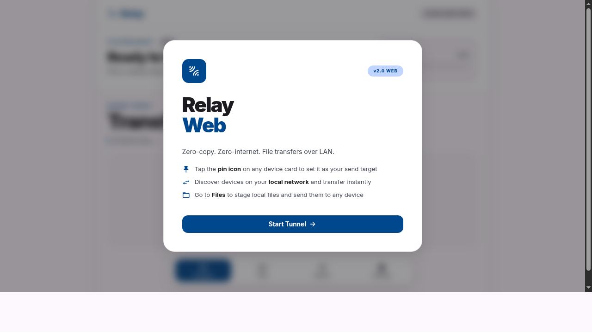
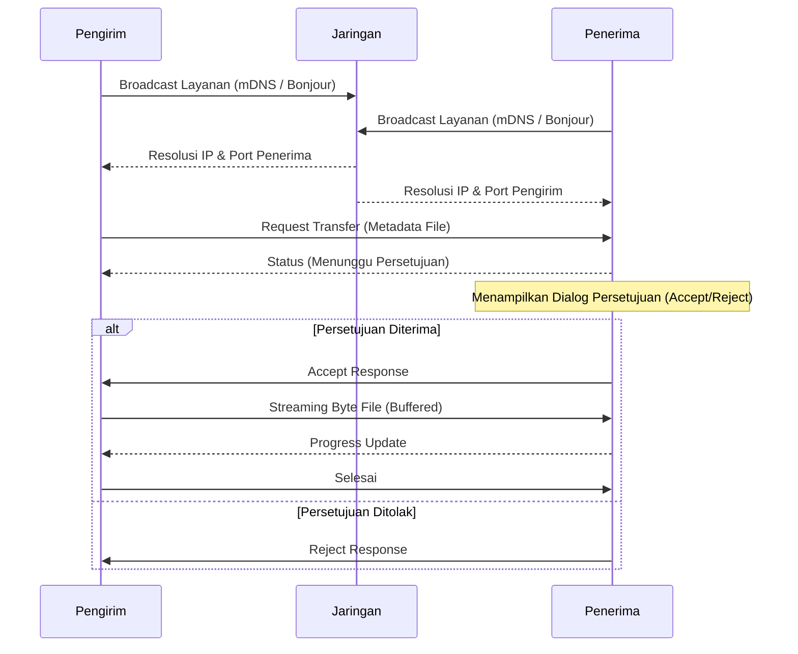

# Relay

Relay adalah aplikasi transfer file lokal (Local Area Network) peer-to-peer (P2P) yang dirancang untuk kecepatan, keamanan, dan kemudahan tanpa memerlukan koneksi internet aktif. Proyek ini terdiri dari dua komponen utama: aplikasi Web dan aplikasi Mobile (Android).



## Deskripsi Sistem

Relay memungkinkan pengguna untuk mengirim dan menerima file secara langsung antar perangkat dalam satu jaringan lokal yang sama (Wi-Fi atau Ethernet) dengan menggunakan arsitektur buffered-streaming dan zero-internet. 

### Versi Mobile (Android)
Aplikasi mobile Relay berfungsi sebagai simpul utama (node) dalam mobilitas sehari-hari. Aplikasi ini dibangun dengan standar Android modern, difokuskan pada efisiensi baterai dan kecepatan transfer. Tentu saja, aplikasi ini berjalan secara stabil dan kompatibel pada seluruh perangkat Android masa kini. Fitur utamanya mencakup:
*   **Pemindaian Jaringan Otomatis:** Menemukan perangkat lain di jaringan lokal menggunakan mDNS (Multicast DNS) dan Network Service Discovery (NSD).
*   **Transfer Latar Belakang:** Mampu menerima dan mengirim file sambil tetap menjaga stabilitas aplikasi meskipun pengguna sedang membuka aplikasi lain.
*   **Manajemen File Terintegrasi:** Mengelola file yang diunduh langsung di dalam aplikasi dengan antarmuka yang bersih dan responsif.
*   **Keamanan Terdesentralisasi:** Setiap transfer harus melalui persetujuan manual (Accept/Reject) kecuali jika fitur Auto-accept diaktifkan untuk perangkat yang dipercayai.

### Versi Web
Versi Web dari Relay memberikan fleksibilitas tertinggi karena dapat diakses secara langsung melalui peramban (browser). Ini memastikan aplikasi berfungsi secara sempurna melintasi semua jenis perangkat dan sistem operasi yang memungkinkan (Windows, macOS, Linux, iOS, ChromeOS, dll.) tanpa perlu proses instalasi yang berbelit-belit.
*   **Drag-and-Drop Staging:** Pengguna dapat menarik dan menaruh file ke dalam antarmuka untuk persiapan pengiriman (staging).
*   **Pin Perangkat:** Memungkinkan pengguna menyematkan satu perangkat spesifik untuk pengiriman cepat (Quick Send).
*   **Riwayat Transfer:** Mencatat semua log pengiriman dan penerimaan file secara komprehensif.

## Arsitektur & Teknologi

Relay menggunakan arsitektur Klien-Server hibrida pada setiap instansinya. Setiap perangkat bertindak sebagai peladen (server) dan juga klien secara bersamaan.

### Tech Stack
*   **Mobile (Android):** Kotlin, Jetpack Compose, Ktor Server (CIO), Room (Database Lokal), Coil (Image Loading).
*   **Web:** Node.js, Express, Bonjour-service (mDNS), Vanilla HTML/CSS/JS.

## Diagram Alir (Flowchart)

Berikut adalah diagram alir bagaimana protokol Relay bekerja ketika mentransfer file antar perangkat:



## Cara Kerja

1.  **Inisialisasi Layanan:** Saat aplikasi dijalankan, peladen HTTP internal (Ktor untuk Android, Express untuk Web) akan menyala pada port acak yang tersedia.
2.  **Penemuan (Discovery):** Aplikasi akan menyebarkan eksistensinya melalui mDNS. Layanan ini menyiarkan nama perangkat dan port yang sedang digunakan.
3.  **Tukar Metadata:** Saat pengguna memilih file untuk dikirim, perangkat pengirim akan mengirimkan metadata (nama file, ukuran) ke alamat IP dan port tujuan menggunakan HTTP POST.
4.  **Konfirmasi:** Perangkat penerima akan menerima metadata dan menampilkan antarmuka konfirmasi kepada pengguna.
5.  **Streaming:** Jika disetujui, perangkat penerima memberikan respons OK. Perangkat pengirim kemudian memulai streaming data binari file secara langsung (Direct TCP/HTTP stream). Hal ini dilakukan di atas jaringan lokal, sehingga tidak memakan kuota internet dan memaksimalkan bandwidth router.

## Persiapan Repositori (Git Push Ready)

Proyek ini telah dibersihkan dari file-file analisis sementara dan konfigurasi sisa. Direktori ini sudah siap untuk di-commit dan di-push ke repositori tanpa ada file sampah yang tidak perlu.

## Kompilasi Aplikasi

### Build Android (APK)
Aplikasi Android dapat dikompilasi menjadi APK menggunakan perintah berikut:
```bash
cd LocalLink
./gradlew assembleRelease
```
APK akan diproduksi dan tersedia di repositori ini dengan nama `Relay.apk`.

### Build Web
Aplikasi Web dapat dijalankan langsung:
```bash
cd LocalLinkWeb
npm install
npm start
```
