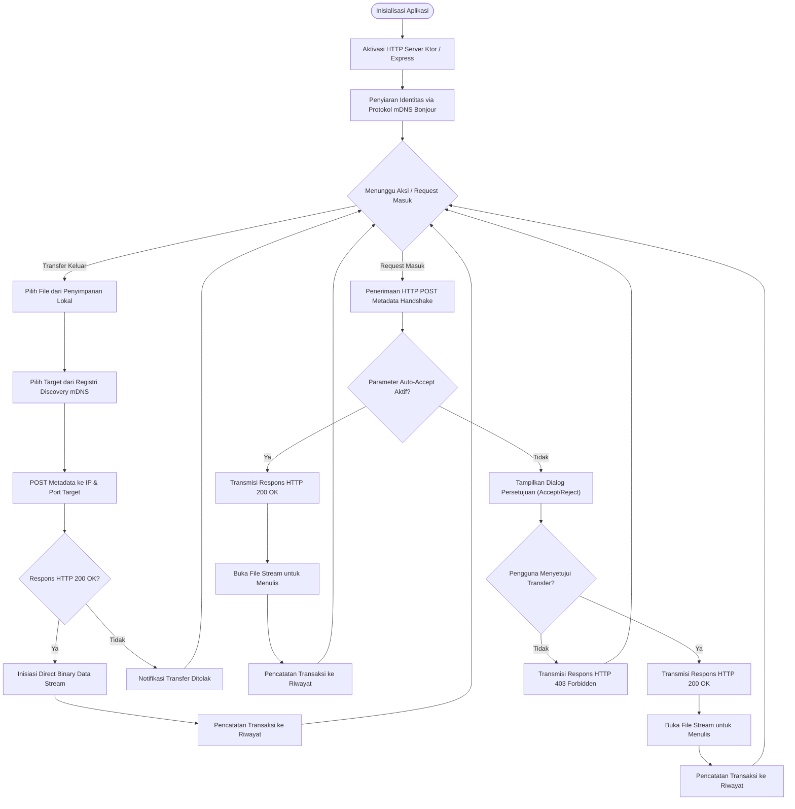

<div align="center">
  <h1>🚀 Relay</h1>
  <p><b>Ekosistem transfer file peer-to-peer (P2P) jaringan lokal berkecepatan tinggi tanpa kuota internet.</b></p>

  <!-- Badges -->
  <p>
    
    
    
    
  </p>
</div>

---

<details>
<summary>📖 <b>Daftar Isi</b> (Klik untuk membuka)</summary>

- [✨ Fitur Utama](#-fitur-utama)
- [📸 Antarmuka & Pratinjau](#-antarmuka--pratinjau)
- [🛠️ Teknologi (Tech Stack)](#-teknologi-tech-stack)
- [🏗️ Arsitektur Sistem](#-arsitektur-sistem)
- [🚀 Panduan Instalasi](#-panduan-instalasi)
- [💻 Panduan Penggunaan](#-panduan-penggunaan)
- [🤝 Kontribusi & Lisensi](#-kontribusi--lisensi)

</details>

---

## ✨ Fitur Utama

*   **⚡ Transfer Sangat Cepat:** Memanfaatkan seluruh *bandwidth* jaringan lokal via *Direct TCP/HTTP streaming*, tanpa dibatasi oleh kecepatan internet provider Anda.
*   **🔍 mDNS Auto-Discovery:** Mendeteksi perangkat aktif di sekitar Anda secara otomatis tanpa perlu mengetik alamat IP secara manual.
*   **🛡️ Keamanan Handshake:** Menerapkan protokol dialog `Terima`/`Tolak` secara ketat, memastikan tidak ada file nyasar yang masuk ke perangkat Anda tanpa izin.
*   **🤖 Kepercayaan Auto-Accept:** Sematkan (*pin*) perangkat yang Anda percayai untuk melewati dialog konfirmasi demi transfer file instan.
*   **📱 Kompatibilitas Universal:** Berjalan secara *native* di Android (Kotlin) dan lancar di Desktop manapun menggunakan Server Web ringan (Node.js).

---

## 📸 Antarmuka & Pratinjau

Berikut adalah cuplikan aplikasi Relay yang berjalan di lingkungan Web maupun Mobile.

<table align="center">
  <tr>
    <td align="center"><b>Dasbor Web</b></td>
    <td align="center"><b>Menu Transfer Mobile</b></td>
  </tr>
  <tr>
    <td align="center"></td>
    <td align="center"></td>
  </tr>
  <tr>
    <td align="center"><b>Riwayat Mobile</b></td>
    <td align="center"><b>Pengaturan Mobile</b></td>
  </tr>
  <tr>
    <td align="center"></td>
    <td align="center"></td>
  </tr>
</table>

---

## 🛠️ Teknologi (Tech Stack)

<div align="center">
  
  
  
  
  
</div>

---

## 🏗️ Arsitektur Sistem

Relay menggunakan arsitektur hibrida P2P yang tangguh. Berikut adalah siklus prosedural (*flowchart*) untuk penemuan jaringan dan mesin transfer:


```mermaid
flowchart TD
    Start([Inisialisasi Aplikasi]) --> Init[Aktivasi HTTP Server Ktor / Express]
    Init --> MDNS[Penyiaran Identitas via Protokol mDNS Bonjour]
    MDNS --> Wait{Menunggu Aksi / Request Masuk}

    Wait -- Transfer Keluar --> Send[Pilih File dari Penyimpanan Lokal]
    Send --> Target[Pilih Target dari Registri Discovery mDNS]
    Target --> Meta[POST Metadata ke IP & Port Target]
    Meta --> Resp{Respons HTTP 200 OK?}
    Resp -- Ya --> Stream1[Inisiasi Direct Binary Data Stream]
    Stream1 --> Hist1[Pencatatan Transaksi ke Riwayat]
    Resp -- Tidak --> Fail[Notifikasi Transfer Ditolak]
    Hist1 --> Wait
    Fail --> Wait

    Wait -- Request Masuk --> Recv[Penerimaan HTTP POST Metadata Handshake]
    Recv --> Auto{Parameter Auto-Accept Aktif?}
    Auto -- Ya --> OK1[Transmisi Respons HTTP 200 OK]
    OK1 --> Stream2[Buka File Stream untuk Menulis]
    Stream2 --> Hist2[Pencatatan Transaksi ke Riwayat]
    Auto -- Tidak --> Prompt["Tampilkan Dialog Persetujuan (Accept/Reject)"]
    Prompt --> Ask{Pengguna Menyetujui Transfer?}
    Ask -- Ya --> OK2[Transmisi Respons HTTP 200 OK]
    OK2 --> Stream3[Buka File Stream untuk Menulis]
    Stream3 --> Hist3[Pencatatan Transaksi ke Riwayat]
    Ask -- Tidak --> Deny[Transmisi Respons HTTP 403 Forbidden]
    Hist2 --> Wait
    Hist3 --> Wait
    Deny --> Wait
```

---

## 🚀 Panduan Instalasi

Ikuti langkah-langkah di bawah ini untuk menjalankan ekosistem Relay di perangkat Anda.

### 1. Menjalankan Server Web (Desktop/Laptop)

Kami telah menyediakan skrip otomasi (*Launchers*) untuk *deployment* seketika.

**🐧 Pengguna Linux (Fedora, Ubuntu, Arch, Hyprland, dll.):**
*   **Opsi Integrasi Sistem (Rekomendasi):** Jalankan `./launchers/install-linux-shortcut.sh` satu kali saja. Skrip ini akan mendaftarkan Relay Server secara *native* ke menu pencarian aplikasi OS Anda (GNOME/Wofi).
*   **Opsi Eksekusi Terminal Langsung:** Jalankan `./launchers/linux-start.sh` di terminal Anda.

**🪟 Pengguna Windows:**
*   Klik ganda (Double-click) pada file `launchers\windows-start.bat`. Skrip ini akan secara otomatis mengunduh semua dependensi Node.js yang hilang dan langsung menjalankan server lokal.

### 2. Memasang Aplikasi Android

**Cara Instan:**
Anda dapat mengunduh dan menginstal file `Relay.apk` yang sudah tersedia di repositori utama (*root folder*).

**Cara Kompilasi Ulang (Build dari Source Code):**
Untuk mengompilasi APK secara mandiri menggunakan Gradle Wrapper, jalankan perintah berikut:
```bash
cd LocalLink
./gradlew assembleDebug
```
*Artifact* aplikasi yang sudah jadi akan muncul di repositori ini.

---

## 💻 Panduan Penggunaan

Setelah Server Web dan aplikasi Android berjalan di satu jaringan Wi-Fi yang sama:

1. **Penemuan Jaringan:** Aplikasi akan otomatis menemukan satu sama lain di tab "Perangkat Terdekat" atau Dasbor.
2. **Proses Pengiriman:**
   * **Dari Android:** Sentuh perangkat tujuan -> Pilih File -> Kirim.
   * **Dari Web:** *Drag and Drop* file apa saja ke tengah dasbor -> Klik tombol "Kirim" pada kartu perangkat target.
3. **Proses Penerimaan:** Perangkat penerima akan memunculkan dialog masuk. Klik **Terima (Accept)** untuk memulai transfer berkecepatan tinggi!

---

## 🤝 Kontribusi & Lisensi

Proyek ini didistribusikan di bawah lisensi **MIT License**.
Silakan buat *Issues* atau kirimkan *Pull Requests* jika Anda ingin meningkatkan arsitektur jaringan atau mengoptimalkan antarmuka (UI).
