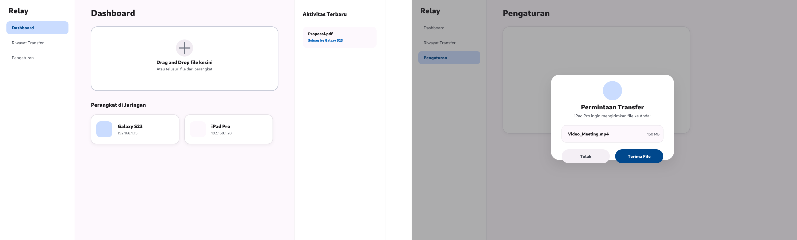
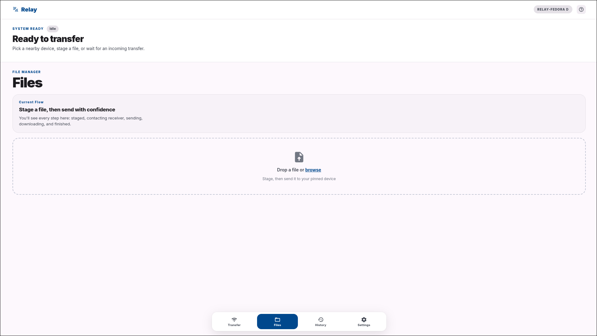
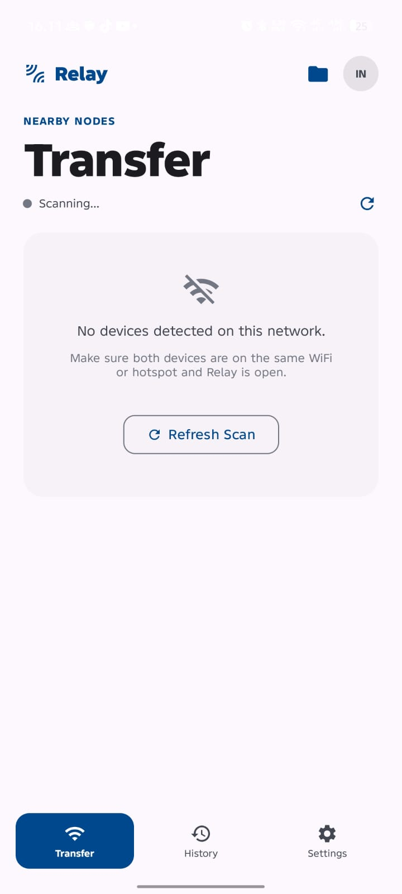
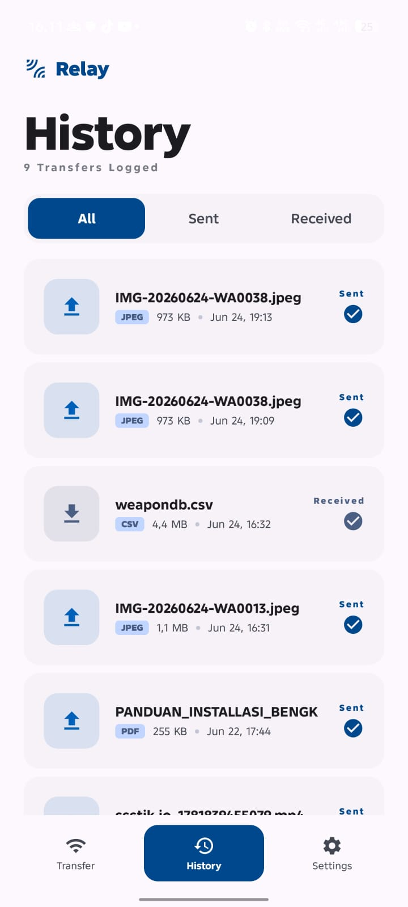
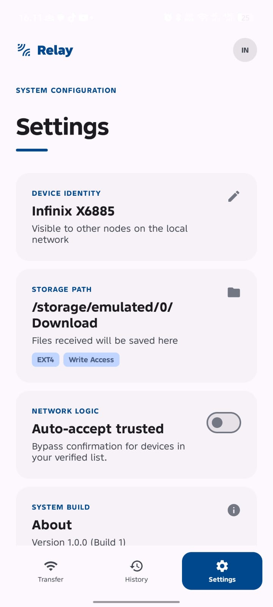
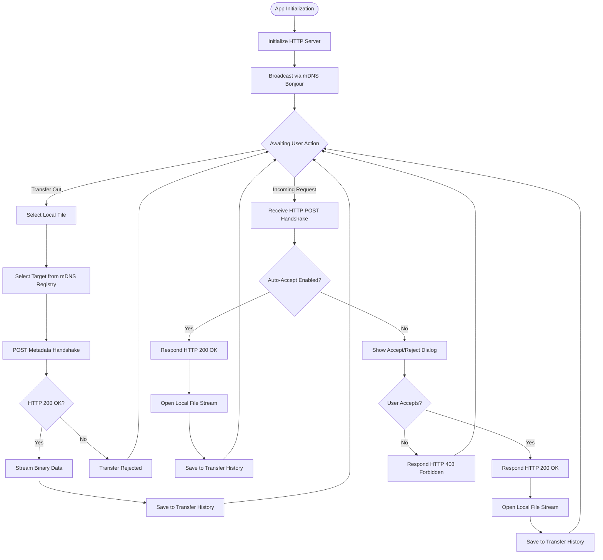

<div align="center">
  
  
  <h1>🚀 Relay</h1>
  <p><b>A high-velocity, zero-internet peer-to-peer local file transfer ecosystem.</b></p>

  <!-- Badges -->
  <p>
    
    
    
    
  </p>
</div>

---

<details>
<summary>📖 <b>Table of Contents</b></summary>

- [✨ Key Features](#-key-features)
- [📸 Interfaces & Component Previews](#-interfaces--component-previews)
- [🛠️ Tech Stack](#-tech-stack)
- [🏗️ System Architecture](#-system-architecture)
- [🚀 Getting Started](#-getting-started)
- [💻 Usage Guide](#-usage-guide)
- [🤝 Contributing & License](#-contributing--license)

</details>

---

## ✨ Key Features

*   **⚡ Blazing Fast Transfers:** Utilizes full local network bandwidth via Direct TCP/HTTP streaming, completely bypassing internet limits.
*   **🔍 mDNS Auto-Discovery:** Seamlessly detects nearby active devices without entering IP addresses manually.
*   **🛡️ Secure Handshake:** Enforces a strict `Accept`/`Reject` protocol, ensuring no unwanted files enter your system.
*   **🤖 Auto-Accept Trust:** Pin trusted devices to skip confirmation prompts for instant transfers.
*   **📱 Universal Compatibility:** Runs natively on Android (Kotlin) and flawlessly on any desktop via a lightweight Web Server (Node.js).

---

## 📸 Interfaces & Component Previews

Here is a glimpse of the application running across different environments.

<table align="center">
  <tr>
    <td align="center"><b>Web Dashboard</b></td>
    <td align="center"><b>Mobile Transfer</b></td>
  </tr>
  <tr>
    <td align="center"></td>
    <td align="center"></td>
  </tr>
  <tr>
    <td align="center"><b>Mobile History</b></td>
    <td align="center"><b>Mobile Settings</b></td>
  </tr>
  <tr>
    <td align="center"></td>
    <td align="center"></td>
  </tr>
</table>

---

## 🛠️ Tech Stack

<div align="center">
  
  
  
  
  
</div>

---

## 🏗️ System Architecture

Relay uses a robust hybrid P2P topography. Below is the procedural state lifecycle for the discovery and transfer engine:


```mermaid
flowchart TD
    Start([App Initialization]) --> Init[Initialize HTTP Server]
    Init --> MDNS[Broadcast via mDNS Bonjour]
    MDNS --> Wait{Awaiting User Action}

    Wait -- Transfer Out --> Send[Select Local File]
    Send --> Target[Select Target from mDNS Registry]
    Target --> Meta[POST Metadata Handshake]
    Meta --> Resp{HTTP 200 OK?}
    Resp -- Yes --> Stream1[Stream Binary Data]
    Stream1 --> Hist1[Save to Transfer History]
    Resp -- No --> Fail[Transfer Rejected]
    Hist1 --> Wait
    Fail --> Wait

    Wait -- Incoming Request --> Recv[Receive HTTP POST Handshake]
    Recv --> Auto{Auto-Accept Enabled?}
    Auto -- Yes --> OK1[Respond HTTP 200 OK]
    OK1 --> Stream2[Open Local File Stream]
    Stream2 --> Hist2[Save to Transfer History]
    Auto -- No --> Prompt[Show Accept/Reject Dialog]
    Prompt --> Ask{User Accepts?}
    Ask -- Yes --> OK2[Respond HTTP 200 OK]
    OK2 --> Stream3[Open Local File Stream]
    Stream3 --> Hist3[Save to Transfer History]
    Ask -- No --> Deny[Respond HTTP 403 Forbidden]
    Hist2 --> Wait
    Hist3 --> Wait
    Deny --> Wait
```

---

## 🚀 Getting Started

Follow these instructions to get the Relay ecosystem running on your devices.

<details>
<summary><b>1. Setting up the Web Server (Desktop/Laptop)</b></summary>
<br>

We provide pre-configured launcher scripts for immediate deployment.

**🐧 For Linux Users (Fedora, Ubuntu, Arch, Hyprland):**
*   **System Integration:** Run `./launchers/install-linux-shortcut.sh` to install Relay natively into your app drawer (GNOME/Wofi).
*   **Terminal Run:** Execute `./launchers/linux-start.sh`.

**🪟 For Windows Users:**
*   Double-click `launchers\windows-start.bat`. It will dynamically resolve all Node dependencies and launch the server.

</details>

<details>
<summary><b>2. Compiling the Android Application</b></summary>
<br>

Compile the Android APK locally using the Gradle Wrapper:

```bash
cd LocalLink
./gradlew assembleDebug
```
The resulting artifact `Relay.apk` will be generated in the root directory.

</details>

---

## 💻 Usage Guide

Once both the Web Server and the Android app are running on the same Wi-Fi network:

1. **Discovery:** The apps will automatically discover each other in the "Sekitar Anda" (Nearby) tab.
2. **Transferring:**
   * **From Android:** Tap the target device -> Select File -> Send.
   * **From Web:** Drag and Drop a file into the dashboard -> Click "Kirim" on the target device card.
3. **Approving:** The receiving device will prompt a dialog. Click **Accept** to initiate the high-speed transfer.

---

## 🤝 Contributing & License

This project is licensed under the **MIT License**.
Feel free to open Issues or submit Pull Requests for structural enhancements and UI optimizations.
