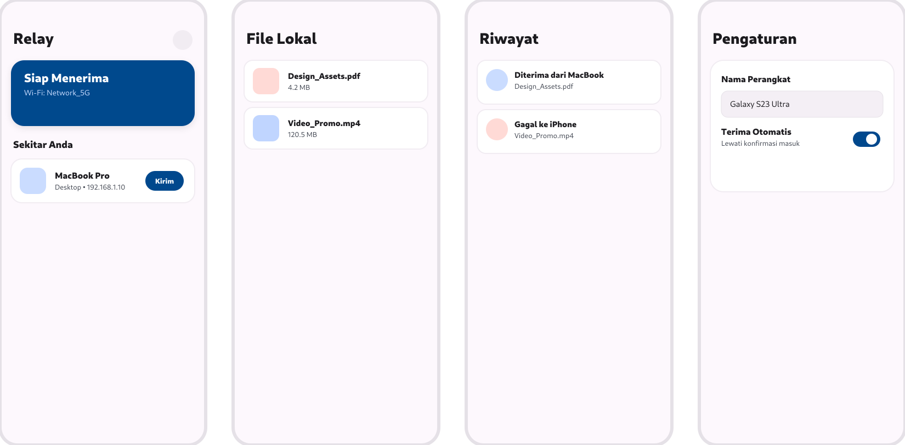
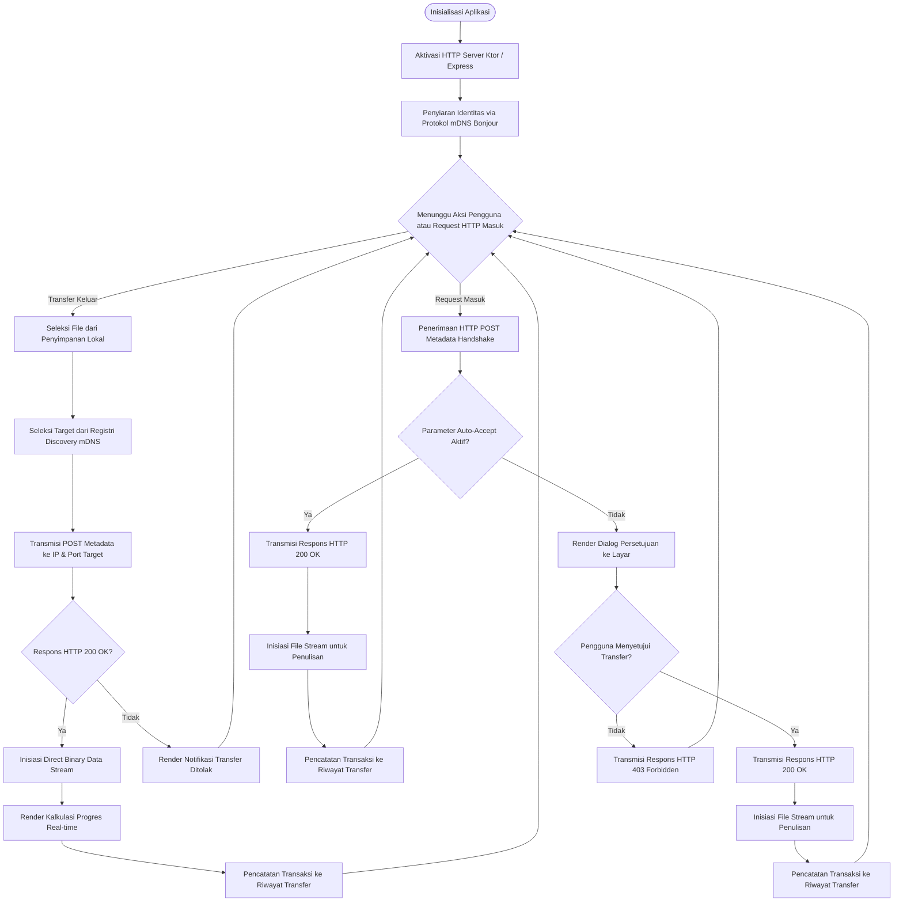

# Relay

Relay adalah sistem aplikasi transfer file *peer-to-peer* (P2P) berbasis Jaringan Area Lokal (LAN) yang direkayasa secara khusus untuk kecepatan tinggi, keamanan data, dan kemudahan akses tanpa memerlukan koneksi internet aktif. Ekosistem perangkat lunak ini terdiri dari dua instrumen utama: Aplikasi Web dan Klien Mobile (Android).

## Antarmuka Visual (Mockup)

### Dasbor Web


### Antarmuka Mobile


## Spesifikasi Teknis & Arsitektur

Relay menggunakan arsitektur Klien-Server hibrida. Setiap simpul perangkat beroperasi secara simultan sebagai peladen (menerima aliran data) dan klien (mengirimkan aliran data).

### Stack Teknologi
*   **Mobile (Android):** Kotlin, Jetpack Compose, Ktor Server (CIO Engine), Room Database, Coil.
*   **Web (Node.js):** Express, Bonjour-service (Protokol mDNS), Vanilla JS/HTML/CSS.

## Diagram Alir Sistem (Flowchart)

Diagram di bawah ini merepresentasikan siklus perpindahan status (*state lifecycle*) secara prosedural pada saat sistem melakukan penemuan jaringan (*network discovery*) dan eksekusi transfer file.


```mermaid
flowchart TD
    Start([Inisialisasi Aplikasi]) --> Init[Aktivasi HTTP Server Ktor / Express]
    Init --> MDNS[Penyiaran Identitas via Protokol mDNS Bonjour]
    MDNS --> Wait{Menunggu Aksi Pengguna atau Request HTTP Masuk}

    Wait -- Transfer Keluar --> Send[Seleksi File dari Penyimpanan Lokal]
    Send --> Target[Seleksi Target dari Registri Discovery mDNS]
    Target --> Meta[Transmisi POST Metadata ke IP & Port Target]
    Meta --> Resp{Respons HTTP 200 OK?}
    Resp -- Ya --> Stream1[Inisiasi Direct Binary Data Stream]
    Stream1 --> Prog[Render Kalkulasi Progres Real-time]
    Prog --> Hist1[Pencatatan Transaksi ke Riwayat Transfer]
    Resp -- Tidak --> Fail[Render Notifikasi Transfer Ditolak]
    Hist1 --> Wait
    Fail --> Wait

    Wait -- Request Masuk --> Recv[Penerimaan HTTP POST Metadata Handshake]
    Recv --> Auto{Parameter Auto-Accept Aktif?}
    Auto -- Ya --> OK1[Transmisi Respons HTTP 200 OK]
    OK1 --> Stream2[Inisiasi File Stream untuk Penulisan]
    Stream2 --> Hist2[Pencatatan Transaksi ke Riwayat Transfer]
    Auto -- Tidak --> Prompt[Render Dialog Persetujuan ke Layar]
    Prompt --> Ask{Pengguna Menyetujui Transfer?}
    Ask -- Ya --> OK2[Transmisi Respons HTTP 200 OK]
    OK2 --> Stream3[Inisiasi File Stream untuk Penulisan]
    Stream3 --> Hist3[Pencatatan Transaksi ke Riwayat Transfer]
    Ask -- Tidak --> Deny[Transmisi Respons HTTP 403 Forbidden]
    Hist2 --> Wait
    Hist3 --> Wait
    Deny --> Wait
```

## Panduan Penggunaan & Peluncuran

### 1. Menjalankan Server Web (Melalui Launcher)

Untuk mempermudah peluncuran aplikasi Web, skrip otomasi (*Launchers*) telah disediakan di dalam direktori `launchers/`.

#### Lingkungan Linux (Fedora, Ubuntu, Arch, dll.)
*   **Opsi Integrasi Sistem:** Eksekusi skrip `./launchers/install-linux-shortcut.sh` satu kali melalui terminal. Skrip ini akan mendaftarkan Server Relay secara otomatis ke *Application Launcher* bawaan OS (GNOME, Rofi, Wofi). Anda dapat membuka server selayaknya aplikasi biasa.
*   **Opsi Eksekusi Langsung:** Eksekusi skrip `./launchers/linux-start.sh` secara langsung dari terminal.

#### Lingkungan Windows
*   Jalankan fail `launchers\windows-start.bat`. Skrip-*batch* ini akan mendeteksi dan mengunduh dependensi Node.js secara otomatis jika belum terpasang, kemudian menjalankan server lokal.

### 2. Kompilasi Klien Android

Aplikasi Android (APK) dapat dikompilasi secara mandiri dari *source code* menggunakan *build-system* Gradle. Eksekusi perintah berikut di terminal:

```bash
cd LocalLink
./gradlew assembleDebug
```
Kompilasi selesai akan menghasilkan *binary* aplikasi yang ditempatkan secara otomatis pada repositori akar (*root*) dengan nama `Relay.apk`.
